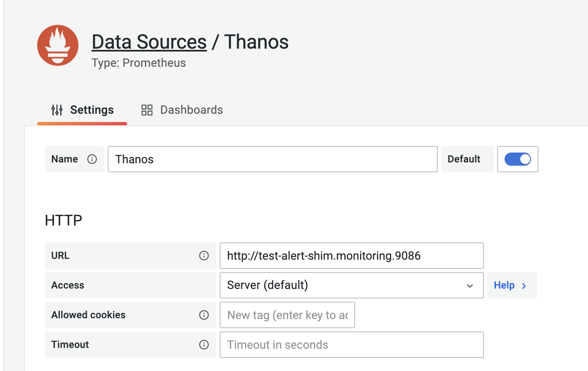
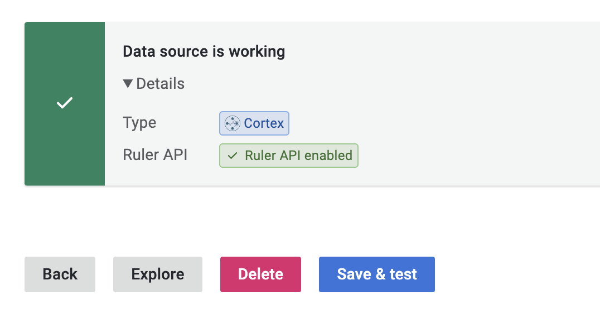

# grafana-alert-shim

**Note**: This project is still under development and may only work in the specific environment of the author.

## Background

Grafana 8 shipped with an awesome feature called [unified alerting](https://grafana.com/go/webinar/intro-to-unified-alerting-in-grafana/), which allow users to manage Prometheus-style alert rules through a straightforward web-ui. However, I encountered several problems when tried to adopt it in my environment:

- Long-term metrics storage like Thanos may separate `rules` API and `query` API in different components, requiring an additional proxy to integrate with unified alerting as a single datasource.
- Rule editing is only available for [Cortex](https://github.com/cortexproject/cortex) and [Mimir](https://github.com/grafana/mimir), which is anti-unified since rule management now requires an additional system outside Grafana.

So I did some investigation and found it is easy to build a shim that mimic the alert rule management of Cortex/Mimir in other prometheus compatible systems. It works in my environment on [Thanos](https://github.com/thanos-io/thanos). Hopefully it would also work on vanilla prometheus with minor modification.

## Roadmap

- [ ] Rule editing
  - [x] Support editing rules stored in k8s ConfigMap
  - [ ] Support editing rules stored in [`PrometheusRule` CRD](https://github.com/prometheus-operator/prometheus-operator/blob/main/Documentation/api.md#prometheusrule)
  - [ ] (**Help wanted**) Support editing rules stored in the above forms, but with single source of truth at an VCS system like git (a.k.a. GitOPS)
- [ ] Compatibility
  - [ ] Test compatibility with vanilla Prometheus
  - [ ] Test compatibility with [VictoriaMetrics](https://github.com/VictoriaMetrics/VictoriaMetrics)

## Test in your environment

```bash
helm install test charts/shim \
  --set conf.querierBaseURL=<prom-query-endpoint> \
  --set conf.rulerBaseURL=<prom-rule-endpoint> \
  --set conf.configmap.namespace=<rule-configmap-ns> \
  --set conf.configmap.name=<rule-configmap-name> \
  --set conf.configmap.key=<rule-configmap-key>
```

For example, in my local development environment with a Thanos cluster, the command would be:

```bash
helm install --namespace monitoring test charts/shim \
  --set conf.querierBaseURL=http://thanos-query:9090 \
  --set conf.rulerBaseURL=http://thanos-rule:9091 \
  --set conf.configmap.namespace=monitoring \
  --set conf.configmap.name=thanos-rules \
  --set conf.configmap.key=rules.yaml
```

Use this shim as the datasource instead of `thanos-query`:



If all goes well you will see that this data source is now recognized as Cortex with Ruler API available:




